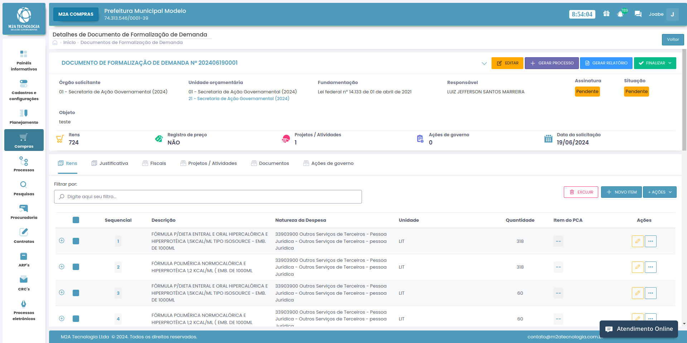

# Processo Administrativo

## Como devemos criar um processo administrativo

### Primeiro passo

Ao logar no sistema deverá ser clicado no menu lateral com o nome de "Compras"
Ao clicar devemos ver uma listagem de documentos de formalização de demandas
Acessando um dos dfd's* deverá encontrar um botão ao lado superior direito "gerar processo"

For full documentation visit [mkdocs.org](https://www.mkdocs.org).

<!--  -->

## Commands

* `mkdocs new [dir-name]` - Create a new project.
* `mkdocs serve` - Start the live-reloading docs server.
* `mkdocs build` - Build the documentation site.
* `mkdocs -h` - Print help message and exit.

~~tachado~~

## Tabela

| Nome  | Idade |
| ----  | ----- |
| Joabe |  28   |
| Alley |  30   |
| magela | 25   |

## Passos para se criar um dfd

 - [ ] clicar no botão de novo dfd
 - [ ] Informaasdi ask dhas j
 - [x] criar os itens

## Emojis

:snake::heart:


## Bloco de código .py

```{.py3 linenums="1" title="base.py"}
def minha_funcao():
    """Documentação"""
    return True
```

### O Juju é meu amigo, o Juju é meu colega!!!

## Project layout

    mkdocs.yml    # The configuration file.
    :snake:
    docs/
        index.md  # The documentation homepage.
        ...       # Other markdown pages, images and other files.
